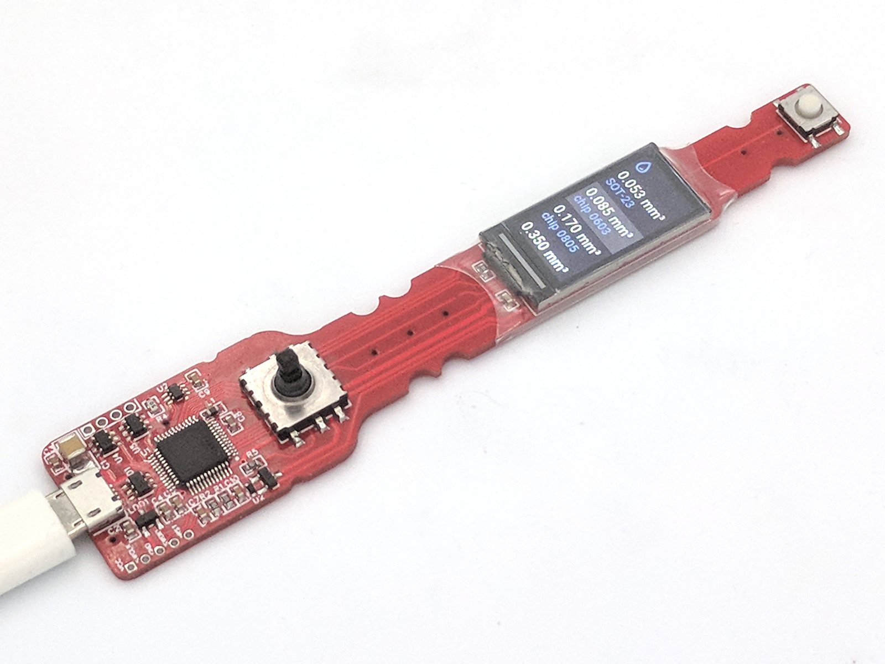
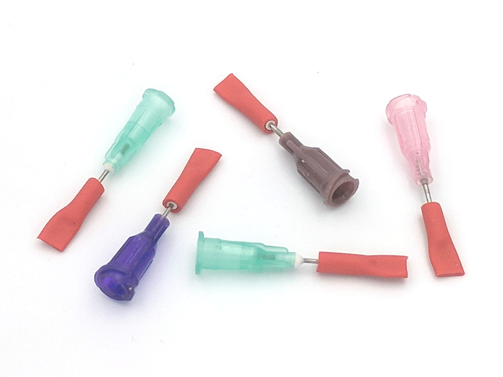

Device assembly <!-- omit in toc -->
===============

- [Required components](#required-components)
- [PCB assembly](#pcb-assembly)
- [Firmware upload](#firmware-upload)
- [Motor & syringe mount](#motor--syringe-mount)
- [Needle caps](#needle-caps)
- [The end :)](#the-end-)

## Required components

This dispenser is inexpensive and small, expected to be used without syringe replace. Consider build separate one for each substance you plan to use (normal
paste, low temp paste, flux).

&nbsp; | Name | Comment
-----|-------------|--------
1 | [PCB & Components](https://easyeda.com/puzrin/dispenser) | Go to EasyEda project page and order both in couple of clicks. If you order PCB first, components second, then you will be able to join delivery and save some bucks. SMT stencil strongly advised, see note below.
2 | [0.96" IPS Display](https://www.aliexpress.com/item/32861823719.html) |
3 | [Micro stepper motor](https://www.aliexpress.com/item/32979960185.html) | Other motors will need rework of 3d-printed supports.
4 | [Gearbox 1:300+ with long shaft](https://www.aliexpress.com/item/32987637967.html) | For max gear ratio select lowest RPM.
5 | [PVC transparent heat shrink tube 23mm](https://aliexpress.ru/item/32787322976.html) | Display mount.
6 | [Double side foam tape, 15*1mm](https://www.aliexpress.com/item/33050888785.html) | Display mount.
6 | [22 AWG wire](https://www.aliexpress.com/item/32854919883.html) | SMT stencil positioning & motor/syringe supports mount.
7 | [Heat shrink tube 35mm](https://www.aliexpress.com/item/32791427710.html) | Motor mount / electronics protection.
8 | [Cable ties 150-200mm](https://www.aliexpress.com/item/32807062474.html) | Syringe mount. 100mm enough for all syringes except 10cc. Width 2.5-3.0mm.
9 | [Silicone heat shrink tube 0.8mm, 1.0mm, 1.5mm](https://atopelec.aliexpress.com/store/group/Silicone-Heat-Shrink-Tubing/118669_505069419.html) | Needle caps, inner layer.
10 | [Heat shrink tube 1:4 with glue, 4mm](https://www.aliexpress.com/item/32787521306.html) | Needle caps, outer layer.
11 | [Joysick cap, 2mm](https://www.aliexpress.com/item/4000005913318.html) | Optional, but recommended.
12 | [Syringes](https://www.aliexpress.com/item/32920861566.html) | 1cc recommended for soldering paste with max precision. 3cc - acceptable. 10cc - for fluxes when precision not critical, and for refill.
13 | [Needles](https://www.aliexpress.com/item/32256297497.html) | Needles choice from syringe set is too small. Buy separate set.
14 | [Micro USB silicon cable](https://www.aliexpress.com/item/32858516897.html) | Very soft cable strongly advised for convenience.

Note. You are strongly advised to order SMT stencil for your PCB. That will
add ~ 8$ in total to your order - good price for convenience. On placing stencil
order at jlcpcb, select option "custom size", and define 30*130mm. Then stencil
will be compact and light, with small delivery cost. You need top layer only. If
you order SMT stencil, add this comment:

_"Please make stencil with my paste layer directly. Make sure 2 TP rounds 0.7mm
with X = 43.0 and X = 108.0 exist"_

## PCB assembly

This sequence is for assembly with heat gun:

- Solder everything except buttons and LCD.
- Solder buttons manually.
- Wash PCB from flux.
- Solder LCD.
- Use IPA to accurately clean LCD soldering area. Or leave as is, if
  your flux is no-clean.

Warning. DON'T USE STRONG CLEANERS WITH LCD. It's not sealed, assembled with
soft glue and will be damaged. That's why it's better to install it in last
moment - you can clean PCB anyhow, but use IPA only with LCD.

Note. _Here it's good idea to upload firmware and check display works, prior to
continue (see instructions in next chapter)_.

Now mount LCD to PCB:

- Use double side foam tape. Stick to LCD first, then cut borders, then stick
  to PCB
- Fit heat shrink tube over that. You need 40mm of 23mm-wide tube. Center it
  over LCD, then shrink sides, front and back.

Don't worry about small air bubbles at screen surface, those will not affect
image quality anyhow. It's possible to use special UV-activated glue for
displays to avoid air gaps. But that does not worth efforts been spent.

Assembled PCB with power on:

## Firmware upload

You need VS Code to build and upload firmware. It's our choice, because
it works on all operating systems and requires almost zero efforts to configure.

1. Install [VS Code](https://code.visualstudio.com/). Then configure hardware if
   needed:
   - For Linux, add [udev rules](http://docs.platformio.org/en/latest/installation.html#troubleshooting)
2. Clone this repo or download as zip archive and unpack somewhere.
3. Open folder in VS Code AND after it suggests to install plugins - agree
   with everything. That should install PlatformIO and all required dependencies.

How to flash:

1. Push joystick button and attach USB cable. It's important to push joystick
   before cable attached, to put device in programming mode.
2. In VS Code menu select `Terminal` -> `Run task` -> `PlatformIO: Upload (hardware_usb)`
   and wait until succeed.
3. Re-insert USB cable. You should see dispenser menu on display.

## Motor & syringe mount

TBD

## Needle caps

It's important to protect soldering paste from drying while not used. Here is
simple recipe of needle caps. You will need 2 heat shrink tubes:

- Small silicone tube. They have small shrink ratio (1.7:1 only), so buy several
  sizes to fit all 0.8/1.0/1.5mm.
- Bigger tube, 4mm, with glue layer & 1:4 ratio.

First, shrink 10mm of silicone tube at needle edge. Then shrink 15-20mm of
bigger tube and squeeze the end. Take off and cut the ends for accurate look.
See result:

## The end :)

When dispenser ready, follow to [User Manual](./manual.md).
